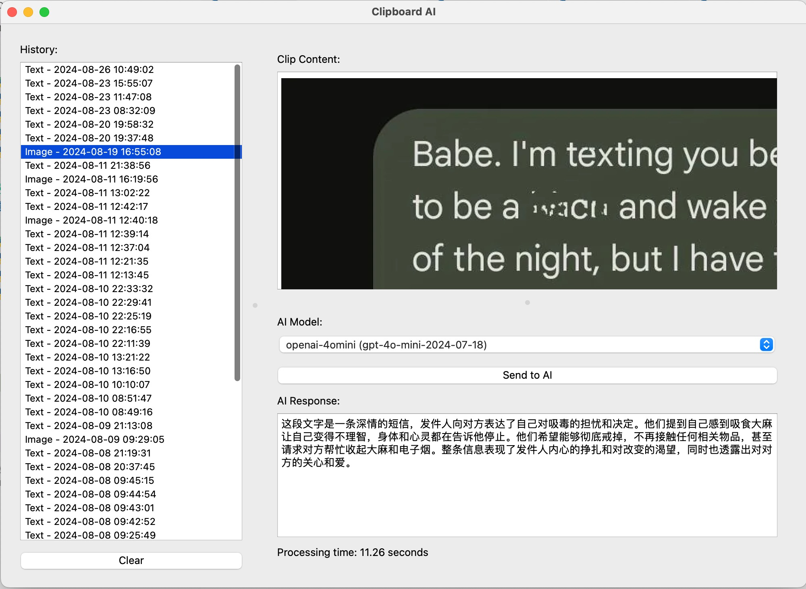
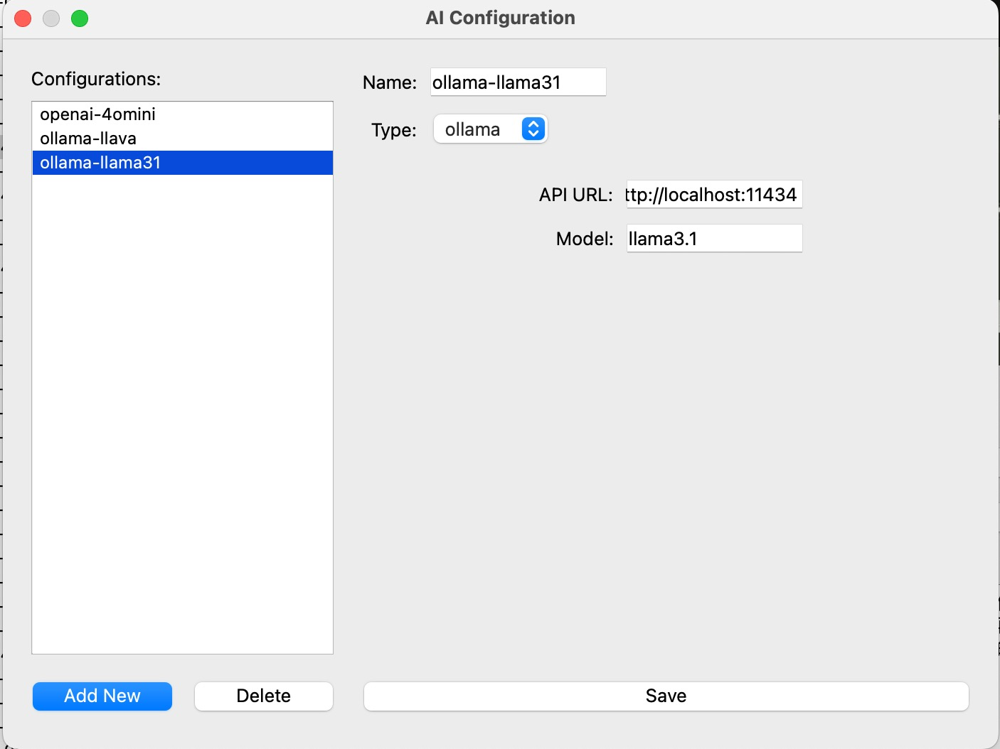

# Clipboard AI

Clipboard AI 是一个功能强大的剪贴板管理工具，通过将 AI 功能直接集成到您的剪贴板工作流程中，提升您的工作效率。该工具监控您的剪贴板文本和图像内容，并根据您复制的内容实时提供 AI 驱动的建议、修改和增强功能。



## 特别说明

本代码80%来自AI（Claude3.5）的协助生成，另有文档说明整个过程：[AI助我写代码（5）：AI自动解析剪贴板文本及图片（Clipboard AI）](https://www.broyustudio.com/2024/09/03/AI-Help-Clipboard-AI.html)

## 功能特点

- **AI 驱动的剪贴板**：自动使用 AI 处理剪贴板内容，实时提供见解或改进建议。
- **可定制的 AI 配置**：轻松创建和管理多个 AI 配置，以根据您的具体需求定制工具。
- **用户友好的界面**：基于 PyQt6 构建的直观 GUI，使您轻松监控剪贴板内容并管理 AI 设置。
- **支持文本和图像处理**：无论您复制的是文本还是图像，Clipboard AI 都能处理并应用相应的 AI 模型。

## 工作原理

Clipboard AI 会持续监控您的剪贴板内容。当检测到内容时，它会自动使用配置的 AI 设置进行处理。用户可以自定义这些设置，以定义 AI 如何响应不同类型的剪贴板内容。结果显示在应用程序的主窗口中，提供即时反馈和进一步操作的选项。

## 优势

- **高效性**：无需人工干预，立即获得 AI 驱动的建议或剪贴板内容的修改。
- **灵活性**：通过可定制的 AI 配置，您可以针对各种工作流程优化工具，从内容创建到数据分析。
- **无缝集成**：该工具在后台静默运行，完美集成到您现有的工作流程中。

## 适用场景

- **内容创作**：在编写过程中获取 AI 生成的建议，提升写作质量。
- **数据分析**：快速分析复制的数据，轻松识别模式或见解。
- **图像处理**：使用 AI 自动改善或分析复制到剪贴板的图像。

## 安装指南

### 前提条件

- Python 3.8 或更高版本
- Python 包管理器 `pip`
- 虚拟环境（推荐）

### 安装步骤

1. **克隆代码库**：
   ```bash
   git clone https://github.com/winglight/clipboard_ai.git
   cd clipboard_ai
   ```

2. **创建并激活虚拟环境**：
   ```bash
   python -m venv venv
   source venv/bin/activate  # Windows 上使用: venv\Scriptsctivate
   ```

3. **安装所需的包**：
   ```bash
   pip install -r requirements.txt
   ```

4. **运行应用程序**：
   ```bash
   python main_window.py
   ```

## 使用指南

### 配置 AI 设置

1. 打开应用程序。
2. 从菜单中选择“设置”进入 AI 配置对话框。
3. 使用提供的界面添加或修改 AI 配置。
4. 保存您的配置并关闭对话框。

### 监控剪贴板

一旦应用程序运行，它将自动监控您的剪贴板。您复制的任何内容（文本或图像）将根据您配置的 AI 设置进行处理。处理后的内容和建议将显示在主窗口中。

### 访问处理后的内容

- 直接在主窗口查看处理后的内容。
- 使用提供的选项复制、修改或保存处理后的内容。

## 贡献

欢迎贡献！请 fork 该代码库并提交 pull 请求。如果是重大更改，请先开启一个 issue 讨论您想做出的更改。

## 许可证

本项目采用 MIT 许可证 - 请参阅 [LICENSE](LICENSE) 文件了解详细信息。
